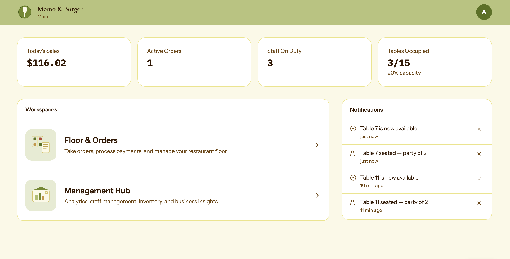
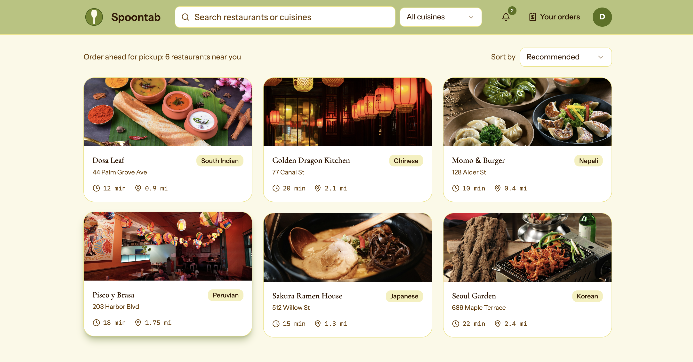
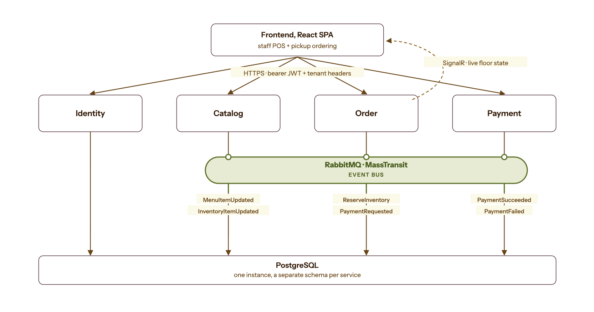

<div align="center">

# Restaurant POS

A cloud-native, multi-tenant restaurant POS platform, four .NET microservices plus a React frontend, event-driven via MassTransit/RabbitMQ, deployed to a single VM behind Caddy.

### 🔗 [**Live demo → spoontab.com**](https://spoontab.com)
One-click demo logins right on the landing page, no credentials to type in, for both the staff POS and diner ordering.

</div>

<br>

<p align="center">
  
  
</p>
<p align="center"><sub>Staff dashboard (left) · Diner ordering (right)</sub></p>

## How it works

The backend is split into four separate services (identity, catalog, order, payment), each with its own database. Instead of calling each other's APIs directly, they mostly talk by sending events to a shared message queue, for example, when the menu changes in catalog, it announces that change rather than order having to ask for it. This keeps the services independent: one going down doesn't take the others with it, and reads stay fast because order keeps its own up-to-date copy of what it needs from catalog instead of fetching it live every time.

<p align="center">
  
</p>
<p align="center"><sub>Fig: service and event-flow architecture</sub></p>

Placing an order is a multi-step process: reserve the stock, confirm the order, then charge the card, each step needs to succeed for the whole order to complete, and if reserving stock fails, nothing gets charged. Payment happens as its own separate step after that, on purpose, so a slow or failed payment never leaves inventory in a weird state.

The platform is multi-tenant, meaning many different restaurants share the same running app, each request says which restaurant and location it's for, and every layer, the database queries included, only ever sees that one restaurant's data. Staff log in with a real username and password through a standard secure login flow; customers get a lighter-weight guest-style login scoped to just their own orders, with no access to restaurant staff features. Card payments go through Stripe, and the backend double-checks the payment result directly with Stripe rather than trusting whatever the browser says happened.

## Testing

A Playwright end-to-end suite drives the real app against the real backend, covering staff login, POS ordering, paying with a live Stripe test card, and the full diner ordering flow.

## Tech stack

| | |
|---|---|
| **Frontend** | React 19, TypeScript, TanStack Query, Tailwind CSS, SignalR, oidc-client-ts |
| **Backend** | ASP.NET Core Web API (.NET 10, with `order` and shared libraries on .NET 8), EF Core |
| **Data** | PostgreSQL, schema-per-service |
| **Messaging** | MassTransit + RabbitMQ |
| **Observability** | Seq, OpenTelemetry, Jaeger/Prometheus/Grafana |
| **Infra** | Docker, Caddy, GitHub Actions, GHCR |

## Quick Start

**Prerequisites**: .NET SDK 10, Node 20+, Docker, a GitHub PAT with `read:packages`.

```bash
cp .env.example .env   # fill in GH_PAT, POSTGRES_PASSWORD, IdentitySettings__AdminUserPassword
./local/dev.sh          # starts infra + all 4 services + frontend
```

Frontend runs at http://localhost:5173. See [`local/README.md`](./local/README.md) for the full local setup.

## Project Structure

```
services/    frontend, identity, catalog, order, payment
shared/      Common.Library, Messaging.Contracts, Tenant.Domain (published as NuGet)
local/       local dev stack
deploy/      production compose + Caddyfile for the deployed VM
```

Each service has its own README with more detail.

## Deployment

Single VM behind Caddy (automatic TLS), images from GHCR, Postgres on Supabase. GitHub Actions builds, pushes, and deploys over SSH on every push to `main`. See [`deploy/README.md`](./deploy/README.md).

---

<div align="center">
<sub>License: Proprietary (internal project)</sub>
</div>
