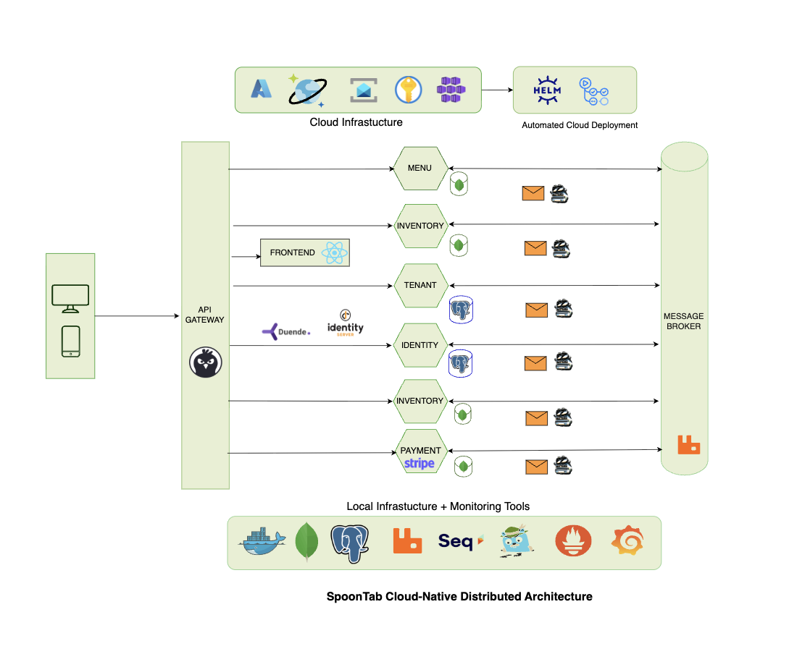

# Restaurant POS Services

A cloud-native restaurant management platform built with microservices architecture, deployed on Azure Kubernetes Service.

## Technologies & Skills

**Frontend**: React, TypeScript, TanStack Query, Tailwind CSS, SignalR  
**Backend**: .NET 8 Microservices, ASP.NET Core Web API  
**Databases**: PostgreSQL  
**Cloud**: Azure Kubernetes Service, Service Bus, Container Registry  
**DevOps**: Docker, Kubernetes, Helm, GitHub Actions, CI/CD  
**Security**: OAuth 2.0/OpenID Connect, JWT Bearer tokens  
**Patterns**: Event-driven architecture, CQRS, Multi-tenancy  

## Architecture Overview



### Key Design Principles
- **Microservices**: Independent, domain-specific services
- **Event-driven**: Services communicate via message broker
- **Multi-tenancy**: Built for multiple restaurant operations
- **Cloud-native**: Deployed on Azure Kubernetes Service (AKS)
- **Containerized**: Docker-based deployment

### Infrastructure Components
- **PostgreSQL**: All service data (identity/tenant, catalog, order, payment), schema-per-service
- **RabbitMQ**: Service-to-service messaging
- **Seq**: Centralized structured logging
- **Azure Kubernetes Service**: Orchestration platform
- **Azure Container Registry**: Container image repository

### Network Architecture
- Kubernetes services and ingress for external communication
- Kubernetes namespaces for resource isolation
- Security: Non-root containers, environment-based secrets, Azure Key Vault integration

## Microservices

**Frontend**: React SPA with OIDC authentication, real-time updates, and tenant-aware UI  
**Identity**: Authentication/authorization service with Duende IdentityServer, including multi-tenant restaurant management and onboarding (merged from the former Tenant service)  
**Menu**: Restaurant catalog with inventory integration  
**Inventory**: Stock tracking with reservation workflows  
**Order**: Cart, order processing, and real-time table management  
**Payment**: Stripe integration with webhook processing

## System Design

### Event-Driven Communication
- Services communicate via events through message brokers
- Order → Payment → Inventory workflows managed via event chains
- Real-time updates via SignalR for table status

### Multi-Tenant Architecture
- Data isolation per restaurant
- JWT claims for tenant context
- Shared infrastructure with logical separation

### Security Model
- IdentityServer with OAuth 2.0
- Role-based access with tenant context
- API scopes for granular permissions

## Infrastructure & DevOps

### Development Workflow
- Docker Compose for local infrastructure (PostgreSQL, RabbitMQ, Seq)
- `scripts/dev.sh` runs services + frontend locally via `dotnet run` / `npm run dev`
- Azure Kubernetes Service for production
- GitHub Actions pipeline for CI/CD
- Shared NuGet packages published via GitHub Packages

### Key Architectural Patterns
- Service-to-service communication via message bus
- Repository pattern for data access
- CQRS for business operations
- Health checks and graceful degradation


## Project Structure

- **services/**: All microservices (frontend, identity, menu, inventory, order, payment)
- **shared/**: Common libraries and contracts
- **infra/**: Infrastructure configuration (Docker, Kubernetes, Helm)
- **docs/**: Documentation and architectural diagrams

## Quick Start

### Local Development

**First-time setup**
```bash
cp .env.example .env
# fill in GH_PAT (GitHub PAT with read:packages), POSTGRES_PASSWORD,
# IdentitySettings__AdminUserPassword, and Stripe test keys if needed
```

**Run everything**
```bash
# Start infra (postgres, rabbitmq, seq) + all services + frontend
./scripts/dev.sh

# Stop the services started by the script (infra keeps running)
./scripts/dev.sh stop
```

Docker Compose (`infra/docker-compose.yml`) is used for infrastructure only.
Services run directly via `dotnet run` (and the frontend via `npm run dev`),
started and managed by `scripts/dev.sh`, which loads `.env`, waits for infra
to be healthy, and trusts the local HTTPS dev certificate automatically.

### Key Tools
- **Seq**: Logging at http://localhost:5341
- **RabbitMQ**: Message monitoring at http://localhost:15672
- **Swagger**: API documentation at each service's /swagger endpoint

### Common Issues
- **Package Restore**: Check `GH_PAT` is set in `.env`
- **Postgres auth errors**: `POSTGRES_PASSWORD` in `.env` must match what identity/tenant expect (`PostgresSettings__Password`, derived automatically by `scripts/dev.sh`)
- **Service Communication**: Verify message broker connectivity
- **Authentication**: Ensure correct tenant claims in JWT tokens

## Cloud Deployment

### Azure Resources
- **AKS**: Kubernetes orchestration
- **PostgreSQL**: Identity and tenant data
- **Cosmos DB**: Business domain data
- **Service Bus**: Messaging infrastructure
- **Container Registry**: Docker images
- **Application Insights**: Monitoring

### Deployment Pipeline
- GitHub Actions for CI/CD
- Helm charts in `/infra/helm/`
- Azure Key Vault integration

For deployment instructions, see [AZURE_DEPLOYMENT.md](./docs/AZURE_DEPLOYMENT.md).

